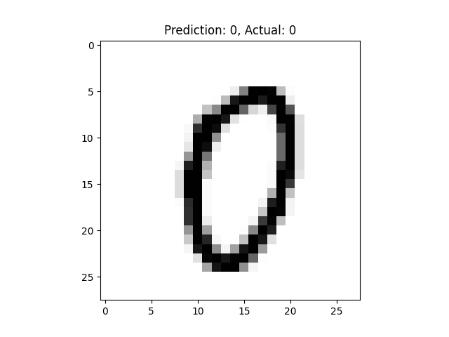

# SebDiReNN - Selfbuild Digit recognition neural network
## A simple neural network build from scratch

>  An example of a prediction generated with the `SebDiReNN` system

### Summary
In modern times, building and training a neural network with librarys like Tensorflow or similar brings a high level of abstraction. This project is my approach to get a better grip at how a neural network works.
